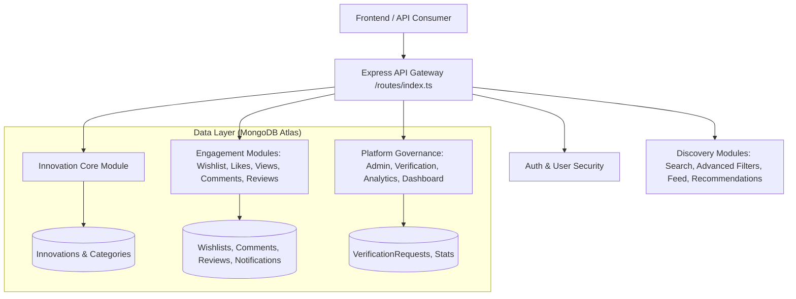

# STAGE 05 — MARKETPLACE CORE IMPLEMENTATION PLAN
## Innomine Premium Innovation Marketplace Backend

---

### 1. Architecture Overview

Innomine is an Innovation-First Marketplace designed specifically for showcasing physical hardware, machinery, electronics, and devices. In Stage 05, the Marketplace Core architecture extends the solid Stage 3A & 3B foundations (Express, TypeScript, MongoDB Atlas, JWT Auth) into a production-ready, Feature-First modular ecosystem.



All new modules strictly adhere to:
- **Clean Architecture & SOLID Principles**: Decoupling REST HTTP handling (Controllers), core business logic and transaction integrity (Services), and database abstraction (Repositories).
- **Read-Heavy Query Optimization**: Using MongoDB indexes, `.lean()` projection for read-heavy operations, and aggregation pipelines for analytics and counts.
- **Strict Validation & OpenAPI Documentation**: Automatic request body/query validation via Zod schemas and complete Swagger OpenAPI annotation on every endpoint.

---

### 2. Modules Implemented

1. **Bookmarks / Wishlist (`src/modules/wishlist`)**:
   - Allows users to bookmark/save innovations, remove bookmarks, check bookmark status, and list saved innovations with pagination.
2. **Likes (`src/modules/innovation`)**:
   - Integrated into the Innovation core; supports toggle like/unlike, duplicate prevention, and real-time like count aggregation.
3. **Innovation Views (`src/modules/innovation`)**:
   - Tracks unique and anonymous views per innovation, preventing spam refreshes and recording last viewed timestamp.
4. **Search Engine (`src/modules/search`)**:
   - Multi-field search across title, description, category, tags, inventor, technology, problem solved, solution, country, institute, and company. Supports autocomplete suggestions and pagination.
5. **Advanced Filters (`src/modules/innovation`)**:
   - Filters innovations by newest, oldest, trending, most liked, most viewed, category, technology, country, innovation stage, patent status, funding status, and open collaboration.
6. **Recommendation Engine (`src/modules/innovation`)**:
   - Rule-based recommendation engine suggesting innovations matching category, tags, technology, and inventor interests.
7. **Homepage Feed (`src/modules/feed`)**:
   - Dedicated feed endpoints providing Latest, Trending, Recommended, Featured, Popular, Most Discussed, and Recently Updated innovations.
8. **Statistics & Platform Analytics (`src/modules/analytics`)**:
   - Provides comprehensive innovation statistics, innovator metrics, category breakdowns, and platform-wide growth analytics.
9. **Innovator Dashboard (`src/modules/dashboard`)**:
   - Aggregates stats for innovators including total innovations, views, likes, bookmarks, comments, followers, and chart-ready time-series data.
10. **MongoDB Optimization**:
    - Comprehensive compound indexing (`status`, `visibility`, `category`, `createdAt`), aggregation pipelines, and `.lean()` read optimizations.
11. **Validation (Zod)**:
    - 100% Zod validation coverage across query parameters, URL IDs, sorting/filtering parameters, and request payloads.
12. **Testing (Jest + Supertest)**:
    - Automated API, repository, and service test suites across all marketplace modules.
13. **OpenAPI Swagger (`src/modules/*/swagger`)**:
    - Detailed OpenAPI 3.0 annotations for all endpoints, schemas, parameters, and responses.
14. **Comments & Reviews (`src/modules/comments` & `src/modules/reviews`)**:
    - Multi-level comments and structured 1-5 star reviews with category ratings and helpfulness votes.
15. **Categories (`src/modules/categories`)**:
    - Multi-level category hierarchy with slug lookups, innovation counting, and icon/image support.
16. **Notifications (`src/modules/notifications`)**:
    - System notification alerts for likes, comments, reviews, and admin actions with read-state tracking.
17. **Administration & Verification (`src/modules/admin` & `src/modules/verification`)**:
    - Innovator credibility verification workflow and admin moderation endpoints for users and innovations.

---

### 3. Folder & Directory Structure Changes

```
backend/src/
├── modules/
│   ├── admin/             # [NEW] Platform moderation & user/innovation oversight
│   ├── analytics/         # [NEW] Platform-wide statistics & growth metrics
│   ├── cart/              # [NEW] Shopping cart module router foundation
│   ├── categories/        # [NEW] Innovation categories hierarchy & aggregation
│   ├── comments/          # [NEW] Innovation discussions & comment threads
│   ├── dashboard/         # [NEW] Innovator analytics & chart-ready stats
│   ├── feed/              # [NEW] Homepage feeds (trending, latest, popular)
│   ├── innovation/        # [UPDATED] Likes, Views, Advanced Filters, Recommendations
│   ├── notifications/     # [NEW] User notifications & read state management
│   ├── orders/            # [NEW] Order lifecycle router foundation
│   ├── payments/          # [NEW] Payment gateway router foundation
│   ├── products/          # [NEW] Product listing router foundation
│   ├── reviews/           # [NEW] 1-5 star ratings & detailed innovation reviews
│   ├── search/            # [NEW] Full-text & multi-field search engine
│   ├── users/             # [UPDATED] Profile management & public innovator profile
│   ├── verification/      # [NEW] Innovator identity & credibility verification
│   └── wishlist/          # [NEW] Saved innovations & bookmark management
└── routes/
    └── index.ts           # [UPDATED] Mounts all 18 feature route modules
```

---

### 4. Database Changes & Indexing Strategy

- **`Wishlist` Collection**:
  - `user` (ObjectId, index), `innovation` (ObjectId, index).
  - Compound unique index `(user, innovation)` to prevent duplicate bookmarks.
- **`Comment` Collection**:
  - `innovation` (ObjectId, index), `author` (ObjectId), `parentComment` (ObjectId, nullable).
  - Index on `(innovation, createdAt: -1)`.
- **`Review` Collection**:
  - `innovation` (ObjectId, index), `user` (ObjectId), `rating` (Number, 1-5).
  - Compound unique index `(innovation, user)` to enforce single review per user per innovation.
- **`Category` Collection**:
  - `name` (String), `slug` (String, unique index), `parentCategory` (ObjectId, nullable).
- **`Notification` Collection**:
  - `recipient` (ObjectId, index), `isRead` (Boolean, index), `createdAt` (-1).
- **`VerificationRequest` Collection**:
  - `innovator` (ObjectId, index), `status` (Enum: `PENDING`, `APPROVED`, `REJECTED`, index).
- **`Innovation` Collection Enhancements**:
  - Additional indexes on `(status, visibility, category, createdAt: -1)`, `(stats.likesCount: -1)`, and `(stats.viewsCount: -1)`.

---

### 5. API Design & Endpoint Matrix

| Module | HTTP Method | Endpoint Path | Auth Required | Description |
|---|---|---|---|---|
| Wishlist | POST | `/api/v1/wishlist/:innovationId` | Yes | Bookmark an innovation |
| Wishlist | DELETE | `/api/v1/wishlist/:innovationId` | Yes | Remove bookmark |
| Wishlist | GET | `/api/v1/wishlist` | Yes | List saved innovations |
| Likes | POST | `/api/v1/innovations/:id/like` | Yes | Toggle like/unlike |
| Views | POST | `/api/v1/innovations/:id/view` | Optional | Record unique view |
| Search | GET | `/api/v1/search` | No | Multi-field search |
| Search | GET | `/api/v1/search/suggestions` | No | Autocomplete suggestions |
| Feed | GET | `/api/v1/feed` | No | Get homepage feed by type |
| Recommendations | GET | `/api/v1/innovations/recommendations/:id` | No | Get similar innovations |
| Analytics | GET | `/api/v1/analytics/platform` | No | Platform-wide stats |
| Dashboard | GET | `/api/v1/dashboard/innovator` | Yes | Innovator activity & stats |
| Comments | GET/POST | `/api/v1/comments/innovation/:id` | Optional/Yes | List/post comments |
| Reviews | GET/POST | `/api/v1/reviews/innovation/:id` | Optional/Yes | List/post reviews |
| Categories | GET | `/api/v1/categories` | No | List category hierarchy |
| Notifications | GET | `/api/v1/notifications` | Yes | Get user notifications |
| Verification | POST | `/api/v1/verification` | Yes | Submit verification request |
| Admin | GET | `/api/v1/admin/users` | Admin Only | List users with filtering |

---

### 6. Validation & Testing Strategy

- **Zod Schema Enforcement**:
  - All request parameters (`:id`, `:innovationId`), payloads, and query filters are validated using dedicated Zod middleware before reaching controllers.
- **Automated Test Coverage**:
  - Created automated test suites using `jest` and `supertest` for every module (`src/modules/*/__tests__/*.test.ts`).
  - Covers HTTP status codes, authorization checks (401/403), schema validation (400), and CRUD success paths (200/201).
- **Verification Command**:
  - Run `npm test` in `backend/` to execute all 14+ unit and integration test suites.
  - Run `npm run build` to verify strict TypeScript type checking without errors.
